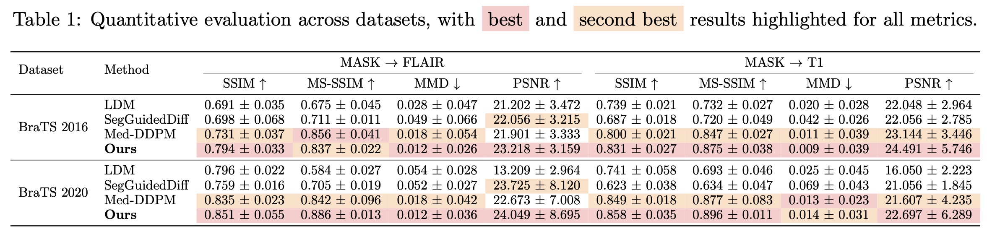

# ZECO: ZeroFusion Guided 3D MRI Conditional Generation

<div align="center">

<p align="center">  </p>

<h2>MVA 2025 Oral</h2>

[Paper](https://arxiv.org/pdf/2503.18246) | [Project](https://brack-wang.github.io/ZECO_web/)


</div>

## Overview
 We present ZECO, a ZeroFusion guided 3D MRI conditional generation framework that extracts, compresses, and generates highfidelity MRI images with corresponding 3D segmentation masks to mitigate data scarcity.

## Installation

```bash
# Clone repository
git clone https://github.com/yourusername/zeco.git
cd zeco

# Create environment
conda create -n zeco python=3.9
conda activate zeco

# Install PyTorch (CUDA 11.8)
pip install torch torchvision --index-url https://download.pytorch.org/whl/cu118

# Install dependencies
pip install -r requirements.txt
pip install monai[all]
```


## Data Preparation

Download [BraTS 2020](https://www.med.upenn.edu/cbica/brats2020/data.html) dataset and update the path in `scripts/train_*.py`:

```python
train_data_dir = "/path/to/MICCAI_BraTS2020_TrainingData"
```

## Training

### Stage 1: 3D VQVAE

```bash
python train.py --model vqvae --channel 0   # FLAIR
python train.py --model vqvae --channel 1   # T1
```

### Stage 2: Latent Diffusion Model

```bash
python train.py --model ldm
```

### Stage 3: 3MCG (Full Model)

```bash
python train.py --model 3mcg
```

For detailed configuration, edit scripts in `scripts/` directly.

## Testing

```bash
# Test VQVAE
python test.py --model vqvae --checkpoint /path/to/vqvae.pth --compute_ssim

# Test LDM
python test.py --model ldm \
    --checkpoint /path/to/ldm.pth \
    --vqvae_checkpoint /path/to/vqvae.pth \
    --compute_ssim

# Test 3MCG
python test.py --model 3mcg \
    --checkpoint /path/to/controlnet.pth \
    --vqvae_checkpoint /path/to/vqvae.pth \
    --compute_ssim --visualize
```

**Available metrics:** `--compute_fid`, `--compute_ssim`, `--compute_mmd`

## Results

<details open>
<summary><b>Visual Comparisons</b></summary>


</details>

<details open>
<summary><b>Quantitative Results</b></summary>



</details>

## Citation

```bibtex
@article{wang2025zeco,
  title={ZECO: ZeroFusion Guided 3D MRI Conditional Generation},
  author={Wang, Feiran and Duan, Bin and Tao, Jiachen and Sharma, Nikhil and Cai, Dawen and Yan, Yan},
  journal={arXiv preprint arXiv:2503.18246},
  year={2025}
}

@article{feiran2025zeco,
  title={ZECO: ZeroFusion Guided 3D MRI Conditional Generation},
  author={Feiran, Wang and Bin, Duan and Jiachen, Tao and Nikhil, Sharma and Dawen, Cai and Yan, Yan},
  journal={IEICE Proceedings Series},
  volume={93},
  number={O1-2-2},
  year={2025},
  publisher={The Institute of Electronics, Information and Communication Engineers}
}
```

## Acknowledgments

- [MONAI](https://monai.io/)

## License

MIT License. See [LICENSE](LICENSE) for details.
