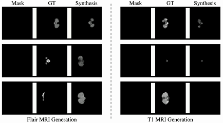

&nbsp;

  

[Paper](https://arxiv.org/pdf/2503.18246) | [Project](https://brack-wang.github.io/ZECO_web/) 

<h2> ZECO: ZeroFusion Guided 3D MRI Conditional Generation </h2> 

 
<!--   -->

ZECO Pipeline.

&nbsp;

# Introduction

### This is the official implementation of ZECO the code is coming soon! If you find this repo useful, please give it a star ⭐ and consider citing our paper. Thank you!

### Performance

<b>Qualititive Result</b>

<b>Quantitive Result</b>

# Scientific Application ⭐

Our ZECO model has demonstrated strong generalization in generating 3D neuron images from sparse datasets in our scientific project "A Unified Framework for Unsupervised Sparse-to-dense Brain Image Generation and Neural Circuit Reconstruction", [have a look](https://brack-wang.github.io/brainbow_webpage/generative_model.html)
